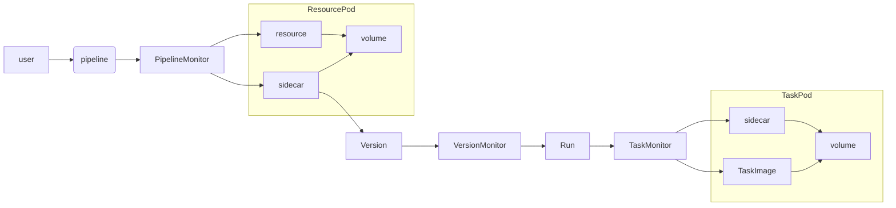

# Minion CI

An entirely kubernetes-based CI system, using CRDs as the specification language and a combination of operators and kubernetes primitives to do the heavy lifting.

## Custom Resources For The User

### Resource
---
A resource is a way of checking an external data source for the latest version, loading data and publishing data. It is basically just a docker image, and must implement the following commands as executables within its working directory:

| Executable | Description                                                               |
| ---        | ---                                                                       |
| version    | Writes a string value into the /input/version.txt file                          |
| load       | Writes the loaded data to the /input directory (optional)                 |
| push       | Updates the resource with the content of the /output directory (optional) |

```yaml
apiVersion: "minion.ponglehub.com/v1"
kind: Resource
metadata:
  name: my-resource
spec:
  image: docker.io/resource-checker
  env:
    REPO: git@github.com:username/repo.git
    BRANCH: master
  secrets:
  - name: my-config
    keys:
    - key: id-rsa.pub
      path: /root/.ssh
```

> NB: Should try to implement `git` and `docker` resource types.

### Pipeline
---
```yaml
apiVersion: "minion.ponglehub.com/v1"
kind: Pipeline
metadata:
  name: my-pipeline
spec:
  resources:
  - name: my-resource
    trigger: true
  steps:
  - name: Load source          # Resource step schema
    resource: my-resource
    action: GET
    path: some/sub/path
  - name: Install deps         # Task schema
    image: docker.io/node
    command:
    - npm run install
  - name: Run tests
    image: docker.io/node
    command:
    - npm run test
```

## Custom Resources For Internal Use

### PipelineRun
---
```yaml
apiVersion: "minion.ponglehub.com/v1"
kind: PipelineRun
metadata:
  name: my-pipeline-1
spec:
  status: "Pending" / "Running" / "Error" / "Complete"
  currentTask: task-name / None
```

### Task
---
```yaml
apiVersion: "minion.ponglehub.com/v1"
kind: Task
metadata:
  name: my-task
spec:
  pipeline: parent-pipeline
  run: 1
  image: docker.io/task-image
  status: "Pending" / "Running" / "Error" / "Complete"
```

### Version
---
```yaml
apiVersion: "minion.ponglehub.com/v1"
kind: Version
metadata:
  name: my-version
spec:
  resource: my-resource
  pipeline: parent-pipeline
  version: v1.1.0
```

## Moving Parts

Minimum required:

| Component       | Purpose                                                                                                     |
| ---             | ---                                                                                                         |
| PipelineMonitor | Watch for new pipelines, manage cronjobs for checking resources                                             |
| ResourceSidecar | Sit alongside a resource container, grab version from shared volume when found and update version resources |
| VersionMonitor  | Create PVC and pipeline run when new resource versions found                                                |
| TaskMonitor     | Watch for new tasks being added, create jobs to run those tasks and update tasks when jobs complete or fail |

Nice to have:

| Component       | Purpose                                                      |
| ---             | ---                                                          |
| ApiServer       | Expose pipeline stats externally                             |
| UI              | A pretty UI to visualise pipelines                           |
| TaskSidecar     | Cat completed task logs to persistent storage                |
| LogStore        | Some kind of persistent storage for logs from completed jobs |

## Flow



## Development

The main access point for development is `devspace`

 - Run `devspace init` to create a new `kind` kubernetes cluster, bootstrap the basic infrastructure and deploy the CRDs
 - Run `devspace clean` to tear everything down

Within individual projects in the `/components` directory, `run-test` is a utility to make running integration tests easier

### Basic project structure:

| Directory        | Contents                                                                |
| ---              | ---                                                                     |
| `/infrastructure`| Helm charts and configs for setting up the underlying infrastructure    |
| `/deployment`    | Helm charts for deployment of the entire solution                       |
| `/scripts`       | Automation scripts and helpers for use in devspace commands             |
| `/aliases`       | Helper commands designed to be executed within component directories    |
| `/tests`         | Some example resources that can be `kubectl apply`ed for manual testing |
| `/components`    | Source code for all the docker images                                   |